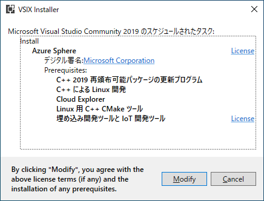

# Azure Sphere ハンズオン 環境準備 (lab0)

## 想定 : xx分

## ゴール

Azure Sphere ハンズオンに向けた環境を準備します

## 最初に

ハンズオンでは、以下のデバイス、環境が必要です:

### デバイス

- [Azure Sphere MT3620 Development Kit](https://seeedjp.github.io/Wiki/MT3620/)

### 環境

- Windows 10 PC (1703 以降/ 1909 または 2004 推奨)
- Azure サブスクリプションに ログイン可能な MS アカウント
- [Azure Sphere SDK](https://docs.microsoft.com/ja-jp/azure-sphere/install/install-sdk)
- [Visutal Studio 2019](https://visualstudio.microsoft.com/ja/downloads/)  (Community Edition 可)
- Git 環境 ([Git](https://git-scm.com/) + [Tortoise Git](https://tortoisegit.org/) など)

## ステップ 0 : Azure Sphere MT3620 Development Kit の準備

Azure Sphere MT3620 Development Kit の開発環境を準備します

1. Development Kit を PC に繋ぐと以下のように "?" のデバイスが表示されます

    

1. Windows Update からドライバーを適用いただくと (インターネットに接続して暫く経つと) 正しく認識されます

    

1. Azure Sphere SDK をインストールします (基本画面通りに進めていただく形です)

    

    > [!TIP]  
    > インストール途中で下記ウィンドウが表示されますので "インストール" を選択してください

    

以上で、Development Kit の準備は完了です  

## ステップ 1 : Visual Studio 2019 の準備

Visual Studio 2019 の Azure Sphere 開発環境を準備します

1. インストーラー を実行します (基本画面通りに進めていただく形です)

    

    > [!TIP]  
    > インストーラー途中にワークロードを指定する画面がありますが、ここは一旦未選択で構いません  

    

1. インストール完了後、Visual Studio 2019 を起動、"コードなしで続行(W)" を選択します

    

1. 拡張機能 から sphere を入力し、Azure Sphere Extention を表示、ダウンロードします

    

    > [!TIP]  
    > ダウンロード後 Visual Stuido 2019 を閉じると追加インストールが開始します

    

以上で、Visual Studio 準備は完了です  

## ステップ 2 : Git 環境の準備

ハンズオン用のサンプルコードのやりとりには Git を用いますので、その準備を行います  
もちろん、git clone が可能なのであれば、他のツールでも構いません  

1. Git インストーラー を実行します (基本画面通りに進めていただく形です)

    

1. Git GUI ツール Tortoise Git インストーラーを実行します (基本画面通りに進めていただく形です)  

    

    > [!TIP]  
    > 後ほど 日本語環境 構築後に設定を行いますので画面上の2つのチェックボックスは外していただいて構いません

    

1. Tortoise Git 日本語 インストーラーを実行します (基本画面通りに進めていただく形です)  

    

    > [!TIP]  
    > "Configure TortoiseGit to use this language" にチェックを入れると、日本語が標準になります  

    

1. インストール が完了したら、デスクトップで右クリック Tortoise Git から **設定 (S)** をクリックします  

    > [!TIP]  
    > 初回 Git との 同期 ＞ 自動終了 が行われる場合があります。その際はもう一度上記実行ください

    

1. 表示された 設定ウィンドウから "初期設定ウィザードを再実施" をクリックします

    

    > [!TIP]  
    > 今回は clone を行うのみですので、"今はこの設定を保存しない" にチェックを入れていただいても問題ありません

    

以上で、 Git 準備は完了です

## まとめ

以上で ハンズオン環境準備は完了となります  
続いて Azure Sphere デバイス側の設定 (紐付け) 等の作業に移ります  

