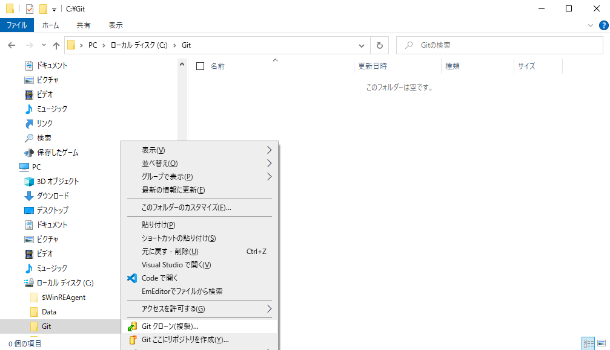
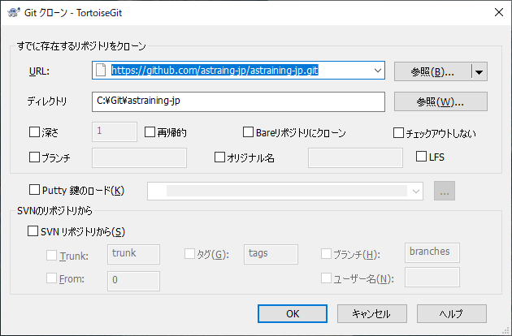
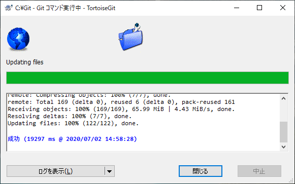

# Azure Sphere ハンズオン 環境準備 (lab2)

## ステップ 0 : lab2 git の クローン

lab2 で用いるサンプルコード等をローカルにダウンロード (clone) します

1. エクスプローラー で clone したいフォルダまで移動し (ここでは C:\Git)、右クリック、**Git クローン(複製)** をクリック  

    

1. 表示される "Tortoise Git" のURL に以下を入力、OK をクリック  
   `https://github.com/astraing-jp/astraining-jp.git`  
   
    
    
    暫く待つと、全てのファイルがダウンロードされますので、それを確認されましたら "閉じる" をクリックして、  
     [lab2 の作業に戻ります](./README.md)  

    

